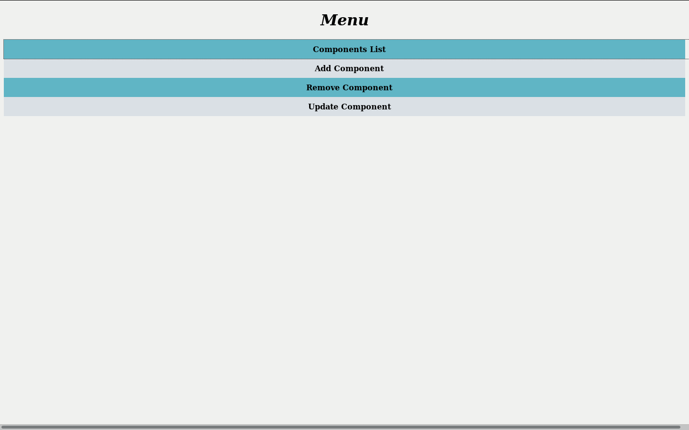

# electronics-list
[](https://travis-ci.org/KNaiskes/electronics-list)

A project to easily keep track of electronics components such as leds, resistors, sensors, microcontrollers and etc.

##### Available options
- Add a new component
- Remove a component
- Modify/Update a component



Building
```
$git clone https://github.com/KNaiskes/electronics-list
$cd electronics-list
$go get -d ./...
$go install
```
